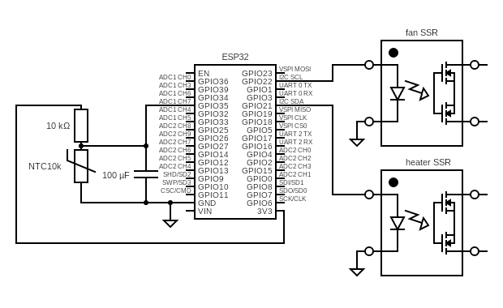
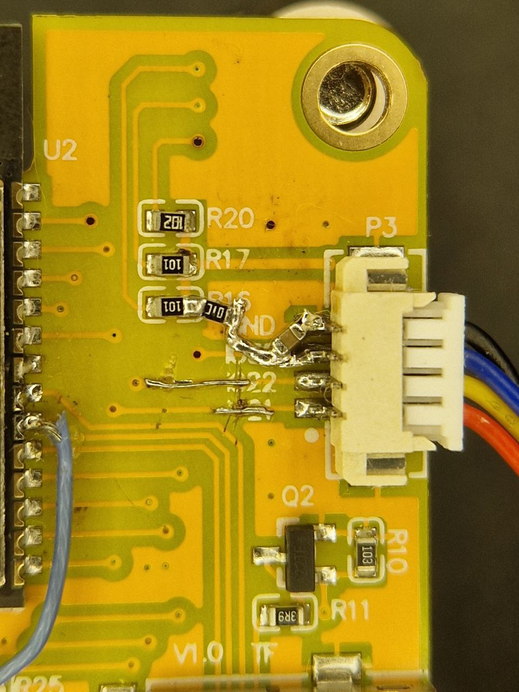

# CYD Dryer / Сушка для пластика/мяса/овощей на "дешевом желтом дисплее"

Идея использовать с минимальными доделками CYD (esp32) пришла несколько месяцев назад в группе vzbot RUS.

Что не нравилось в существующих сушках: для пластиковых коробок +75 верхний предел и низкая мощность. Для железных коробок - gangbang не всегда хорошо переносился катушками из за перегрева при разгоне. 

# Что есть в этой реализации
- ПИД регулятор нагрева с автокалибровкой
- контроль нагрева = открыл дверь и быстро не закрыл, будет ошибка и надо запустить еще раз
- контроль перегрева
- разные варианты настройки ПИД регулятора 
- 90% параметров настраивается через меню и не требует пересборки.

Доступные компоненты:
Ёмкостной экран 2432s032c
- 2 x SSR с управлением 3.3В (esp32) 
- 1 x термистор (капля) 3950 NTC10k (или другой)
- 1 х резистор подтяжка 10кОм (или другой)
- 1 x керамический конденсатор 0,1мкф (104)
- 2 x пигтейла molex picoblade или обжимные 50058-8000 + 51021-0400

ESP32 имеет отвратительный АЦП, по этому без конденсатора не обойтись. Реализация чтения АЦП может удивить даже бывалых.

Все необходимое есть на разъеме P3

конденсатор к соседней земле на разъеме, подтяжка 10к по стрелке "+"

Вариант монтажа NTC. Обратите внимание тут будет хорошо работать только "капля", все варианты в гильзе добавят инерции.

# Интерфейс

# Как работает

При первом запуске необходимо настроить R25 и Beta NTC и номинал делителя R div (по умолчанию NTC 3950 10к/ 10к делитель)

Далее, если есть известные параметры ki,kd,kp можно их задать и не проходить процедуру autopid.

Если при запуске нет ki,kp,kd, то автокалибровка запустится автоматически. Обычно она занимает около 30 минут.

После нее в меню можно будет по вычисленным показателям настроить ПИД коэфициенты:

- PID Basic - дает максимумы, потом участок простоя. 
- PID less overshoot более плавный разгон, меньше перегрев
- PID no overshoot еще более плавный разгон, меньше перегрев

# Установка

Устанавливать можно прямо со страницы, подключив экранчик по USB-C

https://aam335.github.io/cyd-dryer/

### Credits
- [CYD-Klipper](https://github.com/suchmememanyskill/CYD-Klipper) - прекрасный проект!
- [ESP32-Cheap-Yellow-Display](https://github.com/witnessmenow/ESP32-Cheap-Yellow-Display)
- [esp32-smartdisplay](https://github.com/rzeldent/esp32-smartdisplay)
- [squareline.io](https://squareline.io/) - ui редактор для lgvl, куча сэкономленных нервов и времени )